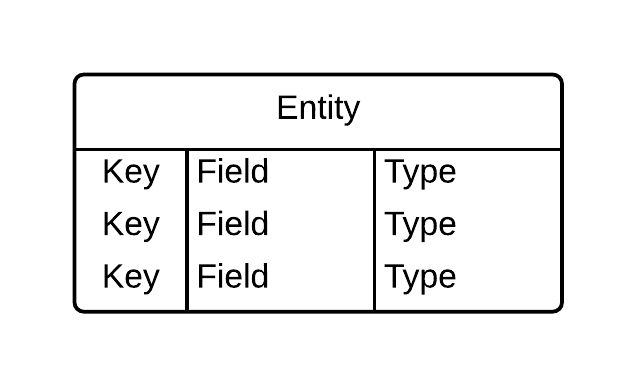

## CSC 105 Lab 4: Microsoft Access

### Lab 4 Topics

* Entity Relationship (ER) Diagrams 
* Creating tables in Access
* Entering data into Access
 
### Goal

The goal of lab 4 is to design and implement a time tracking database. The conceptual model for the database will be very similar to the conceptual model used to create the time tracking Excel project in labs 1 through 3. By the end of this lab you have: 

* Created an entity relationship diagram that models the time tracking problem.
* Created a database in Microsoft Access based on the entity relationship diagram.
* Entered sample data into the database. 

### Admin Details

* **Do not save your work on the hard drive of the lab computers**, it may be erased when you log out! Instead:  
    * Save your work to the `H:/` drive, OR
    * Save your work to some Internet service (e.g. Email, Google Drive, Dropbox etc.). 
* Show your work to the instructor **before** you leave the lab. There are marks for lab participation!
* **Submit** your work to your Connex dropbox. 

### Deliverable

* An entity relationship diagram describing the time tracker problem.
* A Microsoft Access database that implements the entity relationship diagram and contains sample data.

### Concepts
The following discusses the key concepts required to complete the lab exercise.

#### Entity Relationship Diagrams

An Entity Relationship (ER) diagram is a means of describing relationships between different concepts (entities) in a domain. This type of diagram allows analysts to develop and communicate their understanding of a domain without committing to a full database implementation. Many notations for ER diagrams exist, the one used in CSC 105 is as follows. 

##### Entities

Entities are concepts or objects in the domain of interest. They many have attributes such as names, dates, or other descriptors. Entities are represented with a table style notation in which the attributes form the rows: 

    

For example, a Person could be described as: 

    

The three columns are: 

* **key:** indicates whether the attribute is a *primary key*, *foreign key*, or neither. 
* **field:** indicates the name of the attribute.
* **type:** the kind of data used to represent the attribute (number, string, date, etc...). 

##### Relationships

Relationships describe how different entities are connected. Lines connect entities, the ends of which indicate the *cardinality* of the relationships: 

    

For example, a person entity may be related to an address entity: 

    

The example makes two statements about the cardinality of the relationship between the Person and Address entities: 

1. A Person is associated with *exactly one* address.
2. An Address can be associated with *zero of more* Persons. 

##### Primary Keys

The *primary key* of an entity is an attribute that uniquely identifies that element. A primary key is denoted using the "PK" notation when describing an entity. For example, a SIN (Social Insurance Number) is intended to be a unique number for every registered resident/citizen in Canada. 

##### Foreign Keys

An entity may have many *foreign keys* which link one entity to others via relationships. In the previous example, the "address" attribute is a foreign key which is associated with an address entity's id. Foreign keys are denoted with "FK". 

#### Microsoft Access

Microsoft Access is a software tool that allows users to create and manage databases. Data is organized into tables (similar to entities in an ER diagram) which are linked via relationships. 

The lab instructor will demonstrate the basics of Access, including: 

* Creating tables and attributes
* Creating relationships between tables
* Inserting data

### Exercise

#### 0) Time Tracking Problem

Consider the following scenario: 

* You work as a consultant an bill hourly for your time. 
* You are required to track how you spend your time each day. 
    * For example: "on 2016-01-30 you spent 4 hours with Client Alpha on Project Apples and then 3 hours with Client Beta on Project Bananas".  
* You work for many different clients. 
* You may work one or more projects for a client. 
    * You may bill a different hourly rate for each project. 

#### 1) ER Diagram

Create an entity relationship diagram that describes the time tracking problem presented directly above. You may use your choice software to create the ER diagram, consider: 

* *Lucid Chart:* Online diagraming software, free for students. [http://lucidchart.com/](http://lucidchart.com/).
* *Microsoft Word:* Available on lab computers. 
* *Microsoft Visio*  
* *Google Drawing:* Available with a gmail account. [http://drive.google.com](http://drive.google.com).

#### 2) Database Implementation

Create a Microsoft Access database that represents the problem based on the ER diagram you created in step 1. 

Your lab instructor will demonstrate the basics of Microsoft Access at the beginning of the lab. 

#### 3) Sample Data

Enter sample data into the database you created in step 2. At minimum you should include: 

* 3 clients
* 5 projects associated with clients.
* 10 hour entries associated with projects and clients.