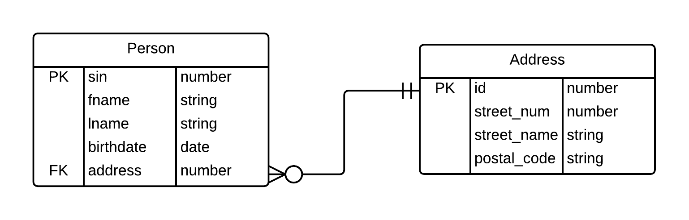

## CSC 105 Lab 5: Microsoft Access

### Lab 5 Topics

* SQL queries
 
### Goal

The goal of lab 5 is to become familiar with and use Microsoft Access to execute SQL queries on the database you made in lab 4. 

### Admin Details

* **Do not save your work on the hard drive of the lab computers**, it may be erased when you log out! Instead:  
    * Save your work to the `H:/` drive, OR
    * Save your work to some Internet service (e.g. Email, Google Drive, Dropbox etc.). 
* Show your work to the instructor **before** you leave the lab. There are marks for lab participation!
* **Submit** your work to your Connex dropbox. 

### Deliverable

* A single text (.txt) file containing information for each of the queries required, for each query record: 

    * the SQL query itself.
    * the result of the query when it was run on your database. 


### Concepts

The following are key concepts you will need to be familiar with in order to complete the lab exercise. You are encouraged to read this section carefully, there are also many resources available online which can be accessed via a quick Google search. 

#### Queries

Queries are like questions that you can ask the database; for example: *"How many hours did I work on the day 2016-01-02"*. If the query is well formed and makes sense with the given database, the database management system will respond an answer. In most cases, software developers write programs that execute queries automatically, however we can write and execute them by hand for practice. 

Queries must be written in a language the database management software (MS Access) can understand, for this we use SQL (see below). A query is *executed* when the *query string* is sent to the database system which will then return the data. 


#### SQL 

[Structured Query Language](https://en.wikipedia.org/wiki/SQL) (SQL) is a language that is capable of interacting with *relational databases* (like MS Access). SQL is standardized and most of its features are available across different database management systems (MySQL, Access, PostgreSQL, etc...). This means that once you learn SQL once, you should be able to use it with other database systems quite easily. 

SQL has a wide range of syntax features, in this lab you will need to use the following syntax: 

* `SELECT ... FROM ...` - [http://www.w3schools.com/sql/sql_select.asp](http://www.w3schools.com/sql/sql_select.asp)
* `WHERE ...` - [http://www.w3schools.com/sql/sql_where.asp](http://www.w3schools.com/sql/sql_where.asp)
* `INNER JOIN ... ON ...` [http://www.w3schools.com/sql/sql_join_inner.asp](http://www.w3schools.com/sql/sql_join_inner.asp)

Use the links provided above to learn about the syntax features you are not familiar with; some of these are also covered in the CSC 105 lecture slides.

##### SQL Queries

Most queries look something like: 

```SQL
SELECT field1, field2, ... FROM table WHERE some_condition; 
``` 

Consider the following ER diagram: 

<div style="text-align:center">
    
</div>

If this ER diagram were to be translated into a database then we could write the following SQL queries: 

**1)** Find the first and last name of all the people in the Person table:
    
    SELECT fname, lname FROM Person;

**2)** Find the SIN number of all the people in the Person table:
    
    SELECT sin FROM Person;

**3)** Find the SIN of all people whose first name is "bob"
    
    SELECT sin FROM Person 
        WHERE fname="bob";

**4)** Find the postal code of all addresses that are on "Smith Street":
    
    SELECT postal_code FROM Address 
        WHERE street_name="Smith Street";
     
**5)** List the first name, last name, and street number of everyone in the database:
    
    SELECT fname, lname, street_num FROM Address 
        INNER JOIN Person ON Person.address=Address.id;

**6)** Find the first names of people who have the postal code "A1B 3C4"
    
    SELECT fname FROM Address 
        INNER JOIN Person ON Person.address=Address.id 
        WHERE Address.postal_code="A1B 3C4";
    
**Note:** *New lines, tabs, and extra spaces are ignored by SQL, use these to improve readability for humans.*

#### Queries in MS Access

The lab instructor will demonstrate how to execute queries in MS Access. If you are still unsure try the following links: 

* [https://www.youtube.com/watch?v=_pE7S-lzpa4](https://www.youtube.com/watch?v=_pE7S-lzpa4)
* [https://support.office.com/en-us/article/Introduction-to-Access-SQL-d5f21d10-cd73-4507-925e-bb26e377fe7e](https://support.office.com/en-us/article/Introduction-to-Access-SQL-d5f21d10-cd73-4507-925e-bb26e377fe7e)

### Exercise

#### 0) Complete Lab 4

If you have not, finish creating your database from lab 4. See the lab 4 lab manual. 

#### 1) Queries

Write and execute queries that meet the following criteria: 

1. List all of the hours recorded in the hours table.
2. List all of the projects in the projects table.
3. List all of the clients in the clients table.
4. List the hours that were recorded on a specific date (e.g. "2016-01-02").
5. List the hours that were recorded on one of two days (e.g. "2016-01-02 or "2016-01-03").
6. List all dates on which more than 4 hours for a project were recorded. 
7. List all of the hours that were recorded for project number 1. 
8. List all of the hours and the associated *project name* (hint: use an `INNER JOIN`)
9. List all of the hours and the associated *client name* (hint: use two nested `INNER JOIN`). 
10. Calculate the amount owed for each of the entries in hours table, calculate this as the product of the number of hours and the project rate. 

#### 2) Submit

* Upload a text file (.txt) containing each SQL query you wrote and the results that were returned to the Connex dropbox.
* Name this file with you student number, eg: `Lab5_V00xxxxxxx.txt`

