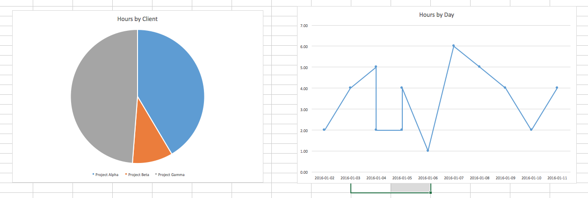

## CSC 105 Lab 3: Microsoft Excel

### Lab 3 Topics

* Charts
* Conditional Formatting

### Goal
The goal of this lab is to augment the workbook from the previous lab with charts and conditional formatting. If you haven't already, you should also focus on completing the work from lab 2. 

### Admin Details

* **Do not save your work on the hard drive of the lab computers**, it may be erased when you log out! Instead:  
    * Save your work to the `H:/` drive, OR
    * Save your work to some Internet service (e.g. Email, Google Drive, Dropbox etc.). 
* Show your work to the instructor **before** you leave the lab. There are marks for lab participation!
* **Submit** your work to your Connex dropbox. 

### Exercise 

#### 1) Complete Lab 2
If you have not already completed the work from lab 2, please finish that before proceeding to the next step. Download the lab 2 guide from course spaces. 

#### 2) Pie Chart

Use the chart tool in Excel to create a pie chart to show the breakdown of hours spent with each project. 

#### 3) Line Chart

Use the chart tool in Excel to create a line chart to show the hours spent each day over time. 

#### 4) Conditional Formatting

Use conditional formatting rules to colour the "Percent Complete" column of the *Projects* sheet red when the "Hours Total" field exceeds the "Hours Estimated". See the guide on using conditional formatting below. 

### Concepts

A few notes on the concepts for this lab are provide below. 

#### Conditional Formatting

Conditional formatting allows you change the appearance of your worksheet based on the data in the worksheet. For example, we could colour all cells that have a value greater than 100% bright green. To create a new conditional formatting rule: 

1. Select the cell (or range) you wish to apply the rule to. 
2. On the top bar find the "Conditional Formatting" button, left-click it. Select "Manage Rules"
3. Click the (+) to add a new rule.
3. Use the wizard to create the rule based on your requirements. 

#### Charts

Excel has a number of built-in chart types of viewing you data in a graphical format. To create a chart:

1. First select the data you wish to display on the Y-axis (select as a range for multiple data points). 
2. Along the top bar select Insert > Chart (choose they style would want, i.e. line, bar, pie etc...). 
3. The chart should be generated automatically. 
4. To select the data for the X-axis right click on the chart and choose the "select data" option. 
    * In the window the pops up use the "Horizontal Labels" field to indicate where the X-axis labels should be taken from. 

### Deliverable

By the end of the lab submit your completed workbook, it should contain an extra sheet named "charts" which contains the following: 

* A pie chart that shows what percentage of time is spent with each project. 
* A line chart that shows the number of hours per day over time. 

It may look something like:

    

Additionally, the *Projects* sheet should use conditional formatting rules to indicate when a project goes over its estimated number of hours, the result should look something like: 

    

Notice the cell coloured red to indicate that the project has gone over time. 
