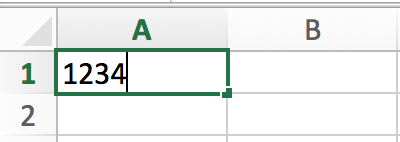
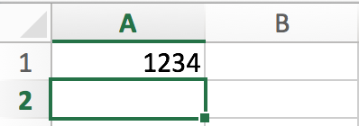
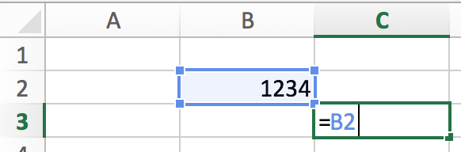
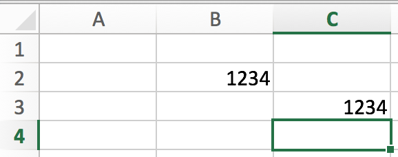
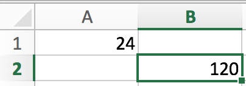
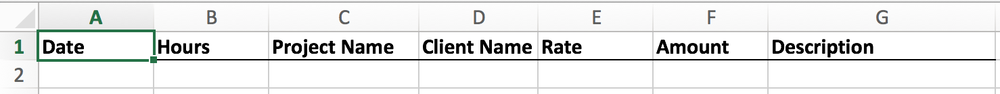
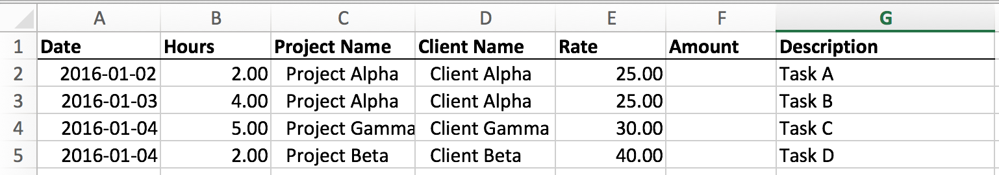
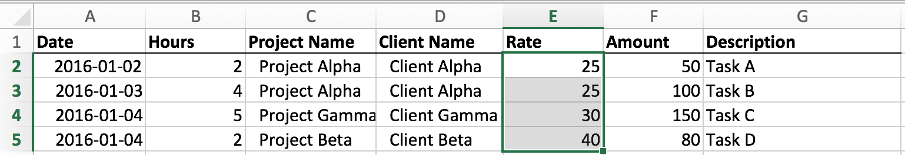

## CSC 105 Lab 1: Microsoft Excel

### Lab 1 Topics

* Admin Details
* Introduction to MS Excel
* Data Entry
* Referencing Cells
* Formulas
* Basic Formatting

### Goal

The goal of today's lab exercise is to create a simply Excel workbook to track your time. In subsequent labs this exercise will be built upon to create an invoice generation tool based on the hours you have entered. 

### Admin Details

* Make sure your activate your UVic CSC Connex account. Go to: [https://accounts.csc.uvic.ca](https://accounts.csc.uvic.ca) and enter your **Netlink** credentials.
* **Do not save your work on the hard drive of the lab computers**, it may be erased when you log out! Instead:  
    * Save your work to the `H:/` drive, OR
    * Save your work to some Internet service (e.g. Email, Google Drive, Dropbox etc.). 
* Show your work to the instructor **before** you leave the lab. There are marks for lab participation!

### Deliverable

By the end of the lab show the instructor a completed Excel sheet with appropriate sample data, the result should be similar to: 

    

Your Excel sheet should meet the following criteria, future week's labs will depend this deliverable:

* Record the following data points (in order):
    1. Date (in ISO format: yyyy-mm-dd)
    2. Number of hours (two decimal places)
    3. A project name (alpha numerical)
    4. A client name (alpha numerical)
    5. The rate ($/hour) (2 decimal places)
    6. Total amount (hours * rate) (2 decimal places)
    7. Description (alpha numerical)
* Use formulas to calculate the the total amount based on the rate and number of hours recorded. 
* Use formatting (Bold font and borders) to indicate column headers
* Use colour to indicate related fields.
    * In future **blue** cells will be for user input, **grey** cells will be calculated. Choose your own colours!

### Concepts
The following discusses the key concepts required to complete the exercise described above. If you are framiliar with these concepts feel free to skip to the exercise. 

#### Data Entry 
All data in an Excel workbook is stored within **cells**. We must enter data into the workbook's cells to work with it. The following describes how to enter data into a cell:

* Double-click the cell with your left mouse button. The cell should show a cursor.
* Enter the data as a series of characters. 
* Either press "Enter" (or "Return") or click away from the cell to commit the data to the cell. 
* The data you entered is now stored in the cell. Don't forget to save your work (File->Save).

      

#### Referencing Cells
Cells can be referenced from other cells by using their index (coordinates) within the sheet. This has the effect of substituting the value of the referenced cell in to the referee cell. 

* As described above, enter data into cell `B2`.
* Select another cell (say `C3` and enter: `=B2` (don't forget the `=`).
    * Using the `=` tells Excel to evaluate expression instead of copying the characters into the cell.
* Press "Enter" (or "Return"), the value from `B2` should appear in the other cell. 

     

#### Formulas
We can use forumlas to compute the value of a mathematical expression and store it in a cell. Formulas may reference other cells. 

A simple formula that multiplies three numbers ($2 \times 3 \times 4$) can be entered via: `=2*3*4`. 

     

A formula that references another cell is entered using the cell's index. For example: `=A1*5` will multiply the value in cell `A1` by `5` and place it in the selected cell. 

     

#### Formatting
Formatting in Microsoft Excel is similar to formatting in other Microsoft products (Word, Power Point etc...). A few Excel specific formatting tools: 

* **Cell Borders** - Control the borders around induvidual or groups of cells.
* **Number formatting** - Control the number of decimal points after a number, whether the number is expressed in dollars ($) or as a percentage (%).
    * Alternatively, select the cell(s) to format and go to *Format->Cells*, adjust the number of decimcal points. 

    

### Exercise 
The following describes steps to guide you through the exercise to create an hour tracking spreadsheet.

#### 1) Column Headers

* Enter the names of each column header (e.g. Date, Hours, etc.)
* Bold the column headers
* Add a lower border to all of the header cells. 

    

#### 2) Sample Data

* Enter sample data into the appropriate cells: Date, Hours, Project Name, Client Name, and Rate, and Description cells.

    

#### 3) Compute Amount

* Use a formula to compute the amount owed based on the hourly rate and number of hours worked. 

    

*HINT: Click and drag or double-click the "handle" at the bottom of selected cell to apply the formula to nearby cells. [Demo GIF 1](http://pakaccountants.com/wp-content/uploads/2014/10/abc-2.gif), [Demo GIF 2](http://i1.wp.com/bradedgar.com/wp-content/uploads/2014/08/Relative_Referencing_Gif.gif?resize=1050%2C320)*

#### 4) Format Numbers

* Use the number formatting tools (see formatting section above) to adjust the number of decimal points in the hours, rate, and amounts column to two demical places. e.g. `2.00` 

#### 5) Remaining Formatting

* Format the rest of the sheet as you see fit. Try out: 
    * Cell colors
    * Cell borders
    * Font face
    * Font size

#### 6) Submit

* Show your lab instructor your working spreadsheet. 
* Save the workbook for next week. 
    * **Do not save your work on the lab computer's hard drive.** It will be deleted by the system. 
