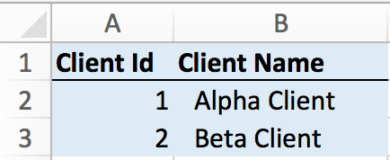
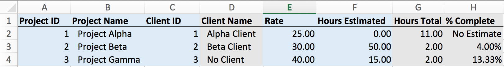
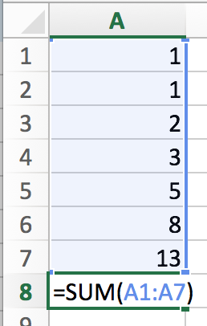
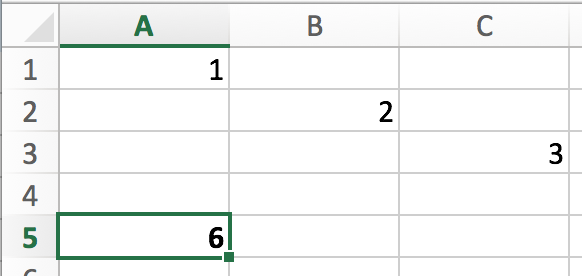
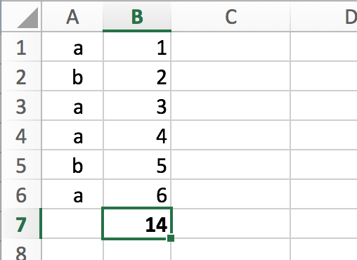
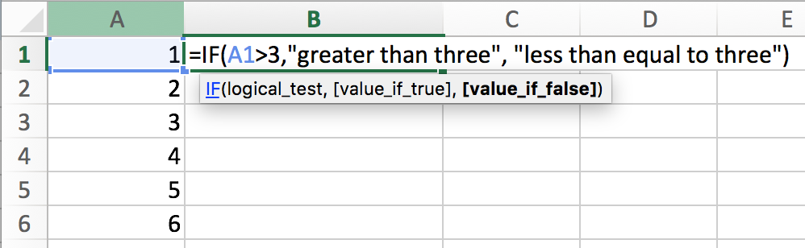
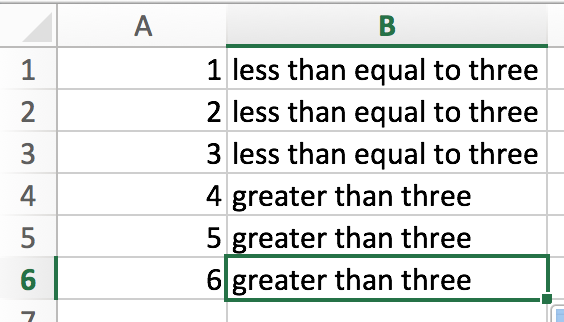

## CSC 105 Lab 2: Microsoft Excel

### Lab 1 Topics

* Absolute v. relative referencing
* Referencing between sheets
* Formulas:
    * [SUM](https://support.office.com/en-us/article/SUM-function-043e1c7d-7726-4e80-8f32-07b23e057f89)
    * [IF](https://support.office.com/en-us/article/IF-function-69aed7c9-4e8a-4755-a9bc-aa8bbff73be2)
    * [SUMIF](https://support.office.com/en-us/article/SUMIF-function-169b8c99-c05c-4483-a712-1697a653039b)
    * [VLOOKUP](https://support.office.com/en-us/article/VLOOKUP-function-0bbc8083-26fe-4963-8ab8-93a18ad188a1)

### Goal

The goal of today's lab is to build on the time tracking exercise you started last lab. In this lab we will add sheets to allow you to manage clients and projects independently of the number of hours worked. 

### Admin Details

* **Do not save your work on the hard drive of the lab computers**, it may be erased when you log out! Instead:  
    * Save your work to the `H:/` drive, OR
    * Save your work to some Internet service (e.g. Email, Google Drive, Dropbox etc.). 
* Show your work to the instructor **before** you leave the lab. There are marks for lab participation!
* **Submit** your work to your Connex dropbox. 

### Deliverable

By the end of the lab show the instructor three completed Excel sheets with appropriate sample data, the results should be similar to: 

**Sheet Clients**: 

    

**Sheet Projects**:

    

**Sheet Hours**: 

    

*Note: grey columns are filled automatically, blue columns require user input.*

Your Excel sheet should meet the following criteria, future lab exercises will depend on this deliverable:

* The **Clients** sheet should have: 
    * Client Id (a number that is unique for every client)
    * Client Name

* The **Projects** sheet should have: 
    * Project Id (a number that is unique for each project)
    * Project Name
    * Client Id (matches an Id from the Clients sheet)
    * Client Name (auto populated using VLOOKUP)
    * Rate ($/hour)
    * Estimated Hours (how long you think the project will take).
    * Hours Total (the number of hours tracked for this project so far).
    * Percent Complete (Total Hours / Estimated Hours)

* The **Hours** sheet should have:
    1. Date (yyyy-mm-dd or yyyy/mm/dd or dd/mm/yyyy).
    2. Number of hours (two decimal places)
    3. The project id
    3. A project name (auto populated using VLOOKUP)
    4. A client id (auto populated using VLOOKUP)
    5. A client name (auto populated using VLOOKUP)
    5. The rate (auto populated using VLOOKUP)
    6. Total amount due (calculated)
    7. Description

* If calculated the "Percent Complete" would result in division by zero display an error message. 
* If an Id (client or project) is entered that does not correspond to a client or project in the respective sheet display an error message. 

### Concepts
The following discusses the key concepts required to complete the exercise described above. If you are familiar with these concepts feel free to skip to the exercise. 

#### Relative v. Absolute Referencing
Cells may be referenced in an equation in another cell via two methods: 

* Relative referencing
* Absolute referencing

Using a relative references allows the current cell to reference a cell that is a *fixed* distance away, e.g. 1 column over and 2 columns down. When the formula in that cell is copied to another cell the references are then taken with respect to the new cell. Consider the following example which shows a relative reference and it being copied to another cell: 

     &nbsp &nbsp &nbsp
    

Notice that in both cases the reference is down two cells and one to the right.

Absolute references do not adjust when the cell is copied, they always reference the *same* cell in the workbook. The dollar sign notation is use to designate absolute references, for example `$B$2`. 

Extra documentation on absolute and relative references can be found [here](https://support.office.com/en-nz/article/Switch-between-relative-absolute-and-mixed-references-538396b3-990e-4b44-9d9c-28b4151d7d21).

#### Referencing Between Sheets

An Excel *workbook* may contain many *sheets*. Sheets may contain references to other sheets. Referencing between sheets uses the `!` notation, for example if a sheet was named "test" then the cell `A5` can be referenced via: `test!$A$5`.

#### Functions

Excel provides many built in *functions* to allow for automatic computation. Excel functions are conceptually similar to functions from mathematics, like $f(x)$. A function may be part of an equation and usually takes as arguments one more cells or a range of cells. 

See below for examples of the `SUM`, `SUMIF`, and `VLOOKUP` functions. 

#### SUM Function

The `SUM` function allows you to compute the sum of all of the inputs. The function takes as an argument a sequence of cell or range references and returns the computed value. Consider two examples of the `SUM` function.

* Using `SUM` on a range:

     &nbsp &nbsp &nbsp
    

* Using `SUM` on a sequence of cells: 

     &nbsp &nbsp &nbsp
    

#### SUMIF Function

The `SUMIF` function only includes values in the sum if some criteria is met. The function takes three arguments: 

* The range to compare against.
* The condition to evaluate.
* The range to actually sum values from.

In the following example the following only values in column B with an "a" in column A are considered in the sum.  

     &nbsp &nbsp &nbsp
    

Extra documentation for the `SUMIF` function can be found [here](https://support.office.com/en-us/article/SUMIF-function-169b8c99-c05c-4483-a712-1697a653039b).

#### VLOOKUP Function

The `VLOOKUP` function allows you to find one value based on the value of another. The function takes at minimum three arguments: 

*  The value to look up. 
*  The range to look in.
*  The column number of the range to return (starting with 1 being the leftmost column in the range).

Consider this example where the character is used to look up a number. 

     
    

Extra documentation and a video tutorial for the `VLOOKUP` function can be found [here](https://support.office.com/en-us/article/VLOOKUP-function-0bbc8083-26fe-4963-8ab8-93a18ad188a1).

#### IF Function

The `IF` function allows you to make a binary decision (two outcomes) based on the value in another cell. The function takes three arguments: 

* A conditional expression (can be true or false).
* A value for if the condition is true. 
* A value for if the condition is false. 

Consider the example below where the numerical value in column A was used to determine the value that gets placed in column B.

    
    

Extra documentation for the `IF` function can be found [here](https://support.office.com/en-us/article/IF-function-69aed7c9-4e8a-4755-a9bc-aa8bbff73be2).

### Exercise 
The following describes steps to guide you through the exercise to improve upon your original hour tracking spreadsheet. Begin by opening the Excel workbook you created in the last lab (download from your dropbox or from your `H:\`). 

#### 1) Create Client Sheet

Create a sheet to track clients. Name the sheet `client`. The sheet should look similar to: 

    

*Note: These are both coloured blue to indicate they are input fields.*

#### 2) Create Project Sheet

Create a sheet to track projects and relate them to clients (in the client sheet). Name is sheet `project`. 

##### 2.1) Headers and Data

Create the following headers: 

* Project id (input)
* Project name (input)
* Client id (input)
* Client name (auto populated)
* Rate (input)
* Hours estimated (input)
* Hours total (calculated)
* % Complete (calculated based on hours total / hours estimated)

Enter some sample data, your sheet may look something like: 

    

##### 2.2) Link Projects to Clients

Use the `VLOOKUP` function to have the Client Name field auto populate based on the Client Id that is entered. For example, given the sample data provided above, if cell `C2` was set to `2` then cell `D2` would update to `Beta Client`. 

##### 2.3) Calculated Percent Complete

Create a formula to calculate the percent complete for each project. Use an `IF` function to make sure only valid division occurs, for example: 

`=IF( AND( F2<>0, ISNUMBER(F2) ), "No Estimate", G2/F2 ) `

Use the [AND](https://support.office.com/en-us/article/AND-function-5f19b2e8-e1df-4408-897a-ce285a19e9d9) and [ISNUMBER](https://support.office.com/en-us/article/ISNUMBER-Function-DAX-02D5FA9A-C0DB-4209-9147-480547E8B5C0) functions if the `IF`. 

#### 3) Update Hours Sheet

##### 3.1) Add Columns

Use the hours sheet you created in the previous lab and add columns so that it looks something like: 

    

Rename this sheet to `hours`. 

##### 3.2) Link Hours and Project Sheets

Use `VLOOKUP` to link together the hours and project sheets based on the Project id column. Use `VLOOKUP` to automatically generate: 

* Project name
* Client Id
* Rate

##### 3.3) Link Hours and Client Sheets

Use `VLOOKUP` automatically populate the Client name in the hours sheet based on the value of the Client id (that was populated in step 3.2). 

##### 3.4) Compute Amount

If not already set up from the previous lab, use a formula to calculate the total amount due based on the number of hours and the rate. 

#### 4.0) Calculate Hours For Each Project

In the project sheet, use the `SUMIF` function to calculate the number of hours for each project. Use the Project id as the condition for the `SUMIF`. For example, based on the sheets presented above cell G2 in the project sheet will have the following formula: 

    =SUMIF(hours!$C:$C,A2,hours!$B:$B)
    
#### 5.0) (Extra) Detect Invalid Client or Project Ids

Use `IF` and `VLOOKUP` functions to only populate fields if the client or project id numbers are valid. If the ids are invalid then display an error message. 