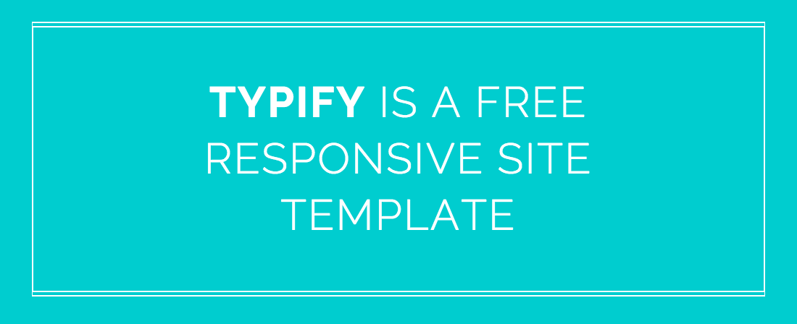
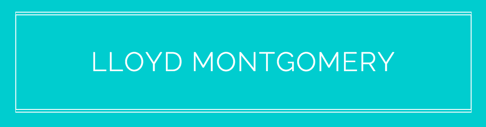
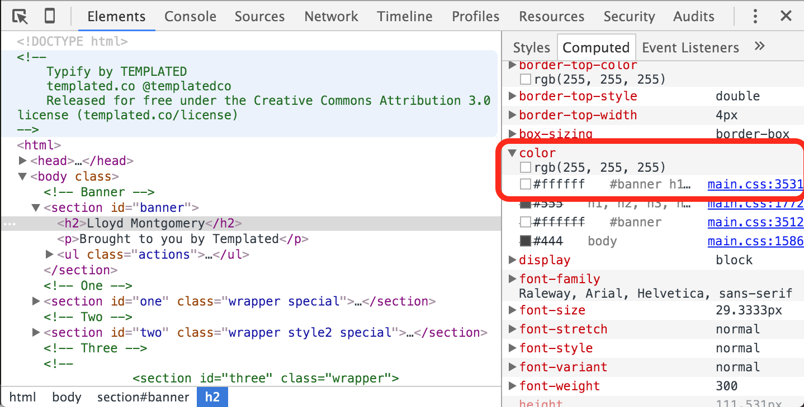
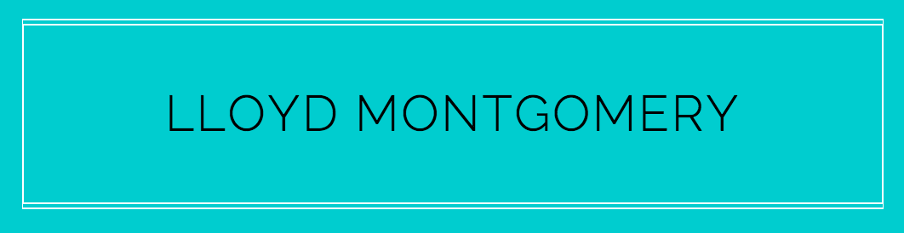

# CSC 105 Lab 9: Templating

## Lab 9 Topics

1. Lab Evaluations
2. Templates
	* Finding
	* Traversing
	* Changing

## Goal
The goal of today's lab exercise is to introduce you to the concept of templating. Templating is the act of taking a website built for the sole purpose of being used by many people, and making it your own. There are people who are so good at making websites, they now provide free templates online just because they can. We will show you a where to find these templates, how to download them, how to traverse (look through) them, and how to personalize them.

## Deliverable

By the end of the lab show the instructor a completed webpage, templated from the example template provided to you.

## Exercise

The following section describes steps to guide you through the exercise to template a website into your own personal website.

### 1) Lab Evaluations

[Lab Evaluations](https://evals.csc.uvic.ca)

### 2) What Are We Doing?
Templating is really quite simple, but you have to try it a few times before you realize just how easy it is to make a website yours. The basic steps are:

1. Find a template website that you like
2. Download it
3. Personalize it
4. Make it Live 

So how do we do that? Well let's walk though the steps to do so, starting with Finding a Template.

### 3) Finding Templates
There are multiple websites where you can go to pick out a template to work from. Here are a few:

* [onepagelove](https://onepagelove.com/)
* [Templated](http://templated.co/)

It is important to note that not all templates are free. It is up to you to make sure you know how to safely browse these sights, paying attention to the potential costs and copyrights attached to each template. However, you can rest easy knowing that *MOST* templates are under the [Creative Commons License](https://en.wikipedia.org/wiki/Creative_Commons_license) which means the creator of the content is allowing anyone to use and modify that content (**BUT**, just like when downloading photos, you need to be aware that all content has some kind of license attached to it, and look for the license information before using the provided content). Additionally, you can also rest easy knowing that *SOME* templates are free. Websites won't let you download ones that are free unless you provide them with some kind of payment information. But again, you have to be aware of what you are doing, and be vigilant knowing that there exists people who are trying to exploit and steal information from you.

The sites we have provided you above are safe sites, but when looking elsewhere for templates, **please be vigilant and safe-guard your information**.

### 4) Unzipping & Opening Templates
For any site offering these templates there will be a download button somewhere. This should download the HTML, CSS, and JS files to your computer so you can edit them. For the purpose of your own personal site, feel free to use any of the sites available to you (free or paid). However, for the purpose of this lab, we are all going to use the same one and modify it to be customized for you.

1. Download
Here is the link to the template we will be using: [Typify](http://templated.co/typify).
Download the above template using the "Free Download" button, and save the files into a folder such as "Lab 9".
2. Extract
Note that the file you downloaded is a ZIP Archive. **YOU MUST EXTRACT / UNPACK THIS ZIP FOLDER BEFORE USING THE FILES**
3. Open the `index.html` File in Chrome. Right-click, open with, Google Chrome (or similar browser)
4. Open the `index.html` file in a text-editor such as Sublime or Notepad++

### 5) Navigating Templates
When you open the `index.html` file in your browser, you will see the template from before, with no changes made yet. The next step is to look for things in that page that you want to change. In the example of the Typify template we downloaded earlier, we may want to edit the header:


<div align="center">
	
</div>

Let's change this text to something else, perhaps your name!

1. Go to your code for `index.html`, and search (control-f or command-f) for the words you see in the header already: `Typify is a free responsive site template`. If that doesn't work, try looking up a smaller set of words, such as: `free responsive site`.
2. Once you have found where this text is in the code, go and customize it! How about we change it to your name.
3. Change the text and reload your web browser.

In my case, the header now looks like this:

<div align="center">
	
</div>

This basic process of finding things you want to change, looking for them in the code, changing them, and then reloading the web browser, is fundamental to working with templates. You need to get good at this.


### 6) Changing CSS
Now that you know how to find and change information on the site, what about changing the styling? If you open up the CSS file associated with this site, you will notice that there is just about 4000 lines of CSS. Yes really. So let's see if we can traverse the CSS in a smart way to save us time and frustration. In order to demonstrate this procedure, we are going to change the color of the header.

#### Find the Code to Change
1. Open `main.css` under assets -> css.
2. Go back to the webpage, right-click on the text in the header, and "inspect"
3. You will notice a panel pops up (either in browser or as a separate window)
4. Find the tab and box signifying the styles on the page. We want to select "Computed" which means, what are the final CSS styles being applied to the header text we just selected.
5. Look for the attribute "color", which we know means text color.
6. Expand the selection to show what is causing the current style.
7. Look for the style that is not crossed out.
8. Take note of the file and line-number listed beside that style. That is where we can find the line in their 4000 lines that will properly change their CSS for us. The picture below should help find what I am describing:

<div align="center">
	
</div>

#### Make the Change
Now that we know that in main.css on line 3531 we will find the code we need to change, let's go and change it. You should see a CSS style: `color: #ffffff;`, we want to change that to something else. How about we change the color to black?

#### Deal with the Effects
Notice what happened? The text changed to black, but so did the border. This kind of fighting with CSS is common, you have to get used to it. But we will not concede just yet, let's try added another attribute to fix this accidental border change, let's add a border-color attribute. So now, our CSS looks like:

```css
color: black;
border-color: white;
```

That did the trick. Now our webpage looks like this:

<div align="center">
	
</div>

Does it look better? That is up to you to decide. In general, you should pick templates that already look like what you want. Do as little CSS and JS changes as possible to avoid frustration; however, given that you know how to write HTML and CSS, if you wish to make small changes you have the tools and knowledge to do so.

### 7) Fighting With Templates
It is worth mentioning, that working with these templates can be frustrating because you don't always know what is going on. There are often multiple CSS and JS files acting on the templates, and therefore finding the information you need can be complicated. One such example of this is the \<nav> tag.

The nav tag is generally used to encompass links that navigate the website. Certain sites use the nav tag in an interesting way, and force the behaviour they want by abusing the CSS that is acting on the nav elements. One such element is the \<ul> tag, which can cause problems for you if you try to add your own \<ul> tags. 

This is all to say that if something is not working, first, check your own tags and CSS to make sure everything is correct, then check the CSS of the provided template because something in there might be acting on your newly added HTML.

### 8) Personalize!
Now it is up to you to make this site your own (or another one, if you choose). There is no end to the amount of time you can spend customizing sites to be your own, but you can certainly pick a side project that involves you picking your favourite template, making it your own, and posting it live! Go and make yourself an online presence!
