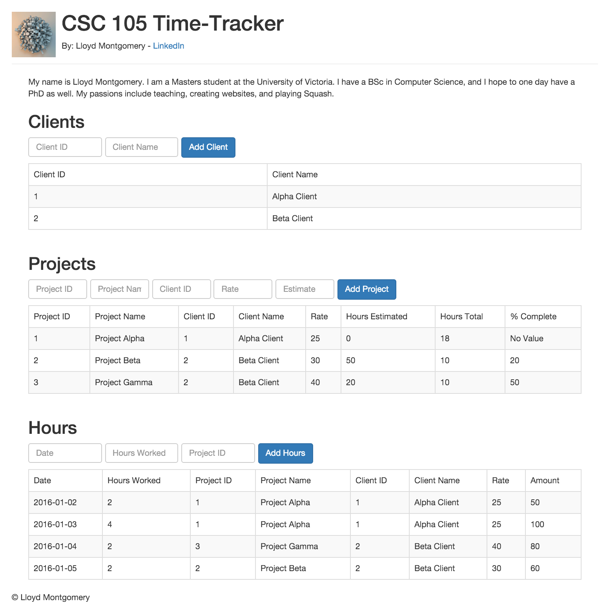
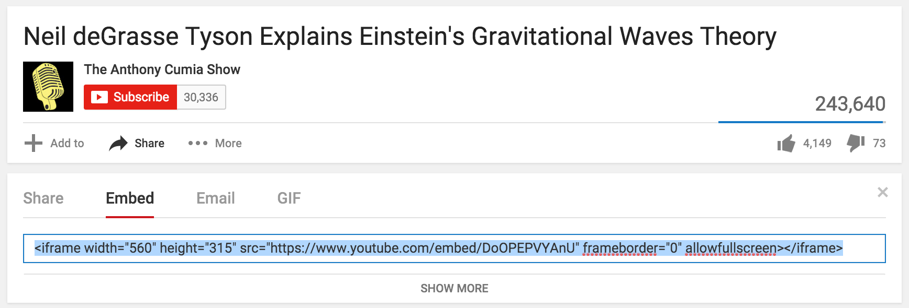

## CSC 105 Lab 6: HTML

### Lab 6 Topics

1. Basic HTML (tags)
	* Body, Head
	* Title
	* img, iFrame (media)
	* a
	* h1
	* div, span
2. Tables
	* thead
	* tbody
	* tr
	* td

### Goal

The goal of today's lab exercise is to introduce you to Web Development. There are three primary languages that are used on the web, and serve as the basis for most (if not all) websites: HTML, CSS, and JavaScript. We will be learning about HTML and the different tags that it has to begin our website. Over the course of the next three labs we will be building a webpage that mimicks the final product we produced in Excel. Here is a screen shot of the final product after all three labs:

<div style="text-align:center">
    
</div>


### Deliverable

By the end of the lab show the instructor a completed webpage with appropriate sample data, the result should be similar to: 

<div style="text-align:center">
    
</div>

Your webpage should meet the following criteria, future week's labs will depend on this deliverable:

1. Have all of the following tags incorporated somewhere in the webpage:
	* Basic HTML (tags)
		* Body, Head
		* Title
		* img, iFrame (media)
		* a
		* h1
		* div, span
	* Tables
		* thead
		* tbody
		* tr
		* td
2. Enter at least two clients into table, more is better

### Concepts
The following discusses the key concepts required to complete the exercise described above. If you are familiar with these concepts feel free to skip to the exercise. 

#### HTML
HTML stands for "Hyper Text Markup Language," and is the first of three languages developed to share information on the world wide web. By "language" we mean programming language. The main purpose of HTML is to simply serve up information, and provide structure to the webpage. If we imagine a fully functioning webpage to be a person, then HTML is the skeleton of the person. HTML defines where content will go, as well as a rough outline of what the page will look like when it is done. Unfortunately, we won't see nice formatting until next week's lab where we learn about CSS.

#### Tags
HTML can be thought of as a two basic things: content (which comes in text form), and tags. The tags allow for structure to be imposed on the page, through invisible boxes that contain the aforementioned content. For example, here we see the \<div> tag creating a box around "Content":

```html
<div>
	Content
</div>
```

It is important to note, that tags do not display once the webpage is rendered. In other words, if we were to created an HTML file with the above code, and open it in our web browser, we would only see "Content" and not the \<div> tags.


### Exercise 
The following describes steps to guide you through the exercise to create an HTML page.

#### 1) Open a Text Editing Program
The lab machines have a few text-editing programs installed:

* Notepad++
* TextPad
* jEdit

You are welcome to use any text editing program you want. I personally use and recommend [SublimeText](https://www.sublimetext.com/), but you'll have to install that on your own machine in your own time if you wish to use it.

#### 2) Create the Lab 6 Folder & HTML File
Once your text editing program is open, it will probably start you on a new blank document. Now create a new folder and save this document in that folder:

Folder:

1. On the Desktop, right click anywhere -> New -> Folder
2. Name the folder: "Lab6"

HTML File:

1. Back in your text editor
2. Click "File" -> "Save As"
3. Save on the "Desktop" in the folder you just created: "Lab6"
4. File name should be: "index.html"


#### 3) Open the HTML file in Google Chrome

1. Right-click on your "index.html" file on your Desktop
2. Open with -> Google Chrome

You should see nothing, as we have not coded anything yet.


#### 4) Create the Basic Skeleton of an HTML Page
Copy and Paste the following code into your index.html file

```html
<!DOCTYPE html>
<html>
	
</html>
```
	
#### 5) Enter Some Content
We have done a lot of work so far with nothing to show for it, let's get some content displaying in Google Chrome! Enter something witty inside the \<html> tags, such as:

```html
<!DOCTYPE html>
<html>
	Hello World!
</html>
```

Refresh the webpage in Google Chrome, and you should see the text appear!

#### 6) Add Proper Structure
Now that we have made our first tag and inserted some content, we need to set up the basic structure that web pages must use. We will also add some of our own structure using HTML5 Tags.

We currently have just HTML tags, these are necessary to define the entire html page. Now we need to add the [\<head>](http://www.w3schools.com/tags/tag_head.asp) and [\<body>](http://www.w3schools.com/tags/tag_body.asp) tags. The head tag is used for metadata, while the body tag is used for all the actual content of the site. If you want more information about these tags, click the tags above to visit w3schools.com, a great resources for learning about web languages. If you ever have a question, go to Google and type in "w3 html \<the tag you want to know more about>" and you will get all the information you need.

Your webpage should now look like:

```html
<!DOCTYPE html>
<html>
	<head>
	</head>
	<body>
		Hello World!
	</body>
</html>
```

#### 7) Title Tag
The purpose of the title tag is to change the text that displays in the tab. Add the title tag to the head, reload the webpage in Google Chrome, and see the result. Code:

```html
<head>
	<title> 105 Time-Tracking App </title>
</head>
```

Google Chrome:
<div style="text-align:center">
    
</div>

#### 8) Header, Footer, and Section Tags
To further give our webpage structure, HTML5 now has header, footer, and section tags. The header tag is used to wrap content that is at the top of the page. The footer is for content you would normally find at the bottom of the page. The section tag is used to break about your webpage into pieces, where each section is self-contained. Let's add those to our webpage. They (along with just about everything else) go in between the body tags. For full details on these tags, use Google.

```html
<body>
	<header>
		This content represents the Heading Content!
	</header>
	<section>
		This is our first section!
	</section>
	<footer>
		This content represents the Footer Content!
		&#169; Lloyd Montgomery
	</footer>
</body>
```

Hopefully these tags make sense given that you have written papers before. The header represents information that introduces content, then you have a number of sections, followed by the footer to close out the content.

Notice the '\&#169;' ? What does the render as when you reload the webpage? This is called an escape sequence/character.
 
#### 9) H1 Tag
Often enough, you'll want to create a title for a section of your webpage, and there are neat tags to do that: h1, h2, ..., h6. h1 is the most important, whereas h6 is the least important. Try adding the h1 tag to your header tag, and put some content in the h1 tag.

```html
<header>
	<h1> CSC 105 Time-Tracker </h1>
</header>
```

See what happened? It got considerably larger and bold. Now try changing it to h2, or h4, what changes?

#### 10) A Tag
The \<a> tag is an important one. This tag is used to make links to other webpages, including ones that you did not make! For example, what if you wanted to link to your LinkedIn page, or your Facebook page? This is how you would do it:

```html
<header>
	<h1> CSC 105 Time-Tracker </h1>
	By: Lloyd Montgomery - 
	<a href="https://ca.linkedin.com/in/lloydmontgomery">LinkedIn</a>
</header>
```

Now, this links to my LinkedIn page, change it to link to your LinkedIn page, or your Facebook if you don't have LinkedIn. Also, did you notice that clicking the link forced the current page to change to the new page? What if you wanted to open the link in a new tab? How would you do that? Try [Google](http://www.w3schools.com/html/html_links.asp).

#### 11) HR Tag
Sometimes, it's nice to separate our content with a horizontal rule. That is done via the \<hr> tag. Try it out!

```html
<header>
	<h1> CSC 105 Time-Tracker </h1>
	By: Lloyd Montgomery - 
	<a href="https://ca.linkedin.com/in/lloydmontgomery">LinkedIn</a>
	<hr>
</header>
```

#### 12) Img Tag
Want to show your face on the internet? Perhaps a company logo? Try the \ tag.

```html

```

But wait, first we need to create a folder called "img" and put an image in there with the name "logo.jpg".

#### 13) iFrame Tag
Want to include a video? We will go over the easiest way to do that: straight from Youtube. If you want to know how to include your own video, you'll have to look that up on Google.

Go to youtube.com, find an appropriate video, and find the "Share" tab, followed by the "Embed" tag, and there it is! Youtube gives you the HTML to render that video on your webpage.

<div style="text-align:center">
    
</div>

#### 14) Article Tag
In HTML5, the article tag is used when there is a self-contained section of content, that can be considered understandable as a stand-alone section. This is slightly different from the section tag, in that article tags are only supposed to contain content, where as a section tag can contain many more tags as well as multiple sections of content.

```html
<section>
	This is our first section!
	<article>
		My name is Lloyd Montgomery. I am a Masters student at the 
		University of Victoria. I have a BSc in Computer Science, 
		and I hope to one day have a PhD as well. My passions include 
		teaching, creating websites, and playing Squash.
	</article>
</section>
```

#### 15) Table Tag
One of the first and most widely-used methods of organizing data on the webpages is in the \<table> tag. The structure of the \<table> tag is a little confusing as first, so I recommend you check out [this link](http://www.w3schools.com/html/html_tables.asp) to learn more about them before proceeding. The final code we expect you to type out and understand is:

```html
<section>
	<table>
		<thead>
			<tr>
				<td> Client ID </td>
				<td> Client Name </td>
			</tr>
		</thead>
		<tbody>
			<tr>
				<td>1</td>
				<td>Alpha Client</td>
			</tr>
			<tr>
				<td>2</td>
				<td>Beta Client</td>
			</tr>
		</tbody>
	</table>
</section>
```

We have seen the section tag before, but the rest should be new to you. \<thead> represents the header information of the table, \<tbody> represents the main content of the table, \<tr> represents a row in the table, and \<td> represents a single cell in the table. Play with the above tags, change the content, and make sure you understand what each of them does. To practice, try adding a third client to the table. For further practice, try adding a 3rd header to the table, such as "Age" of the client, and update each client with an age.

#### 16) Div and Span Tags
We didn't use these tags in the lab today, but they are the most widely used and important tags that exist. The are general tags used to wrap content. The \<div> tag is used to create an invisible box around content, whereas the \<span> tag is used to create a small inline wrapper around content. For more information, please use Google, there is a lot of useful information on the internet.

Here is an example use of Div and Span in code:

```html
<section>
	This is our first section!
	<article>
		My name is <span style="font-weight: bold"> Lloyd Montgomery </span>. 
		I am a Masters student at the University of Victoria. I have 
		a BSc in Computer Science, and I hope to one day have a PhD as 
		well. My passions include teaching, creating websites, and 
		playing Squash.
		<div style="background-color: pink">
			This is additional content inside of a Div.
		</div>
	</article>
</section>
```

The most important thing to remember about Divs and Spans, is that they are general HTML tags that are used all over the place in webpages. The rest of the tags we went over today and specialized, and have a particular purpose when they are used. Div and Span are meant to be used when no specialized tag can be used for the purpose you want. Just use a Div or Span at that point. We will use these two tags in the future labs.

#### 17) Submit

* Show your lab instructor your working webpage. 
* Save the Lab6 folder for next week. 
    * **Do not save your work on the lab computer's hard drive.** It will be deleted by the system. 
